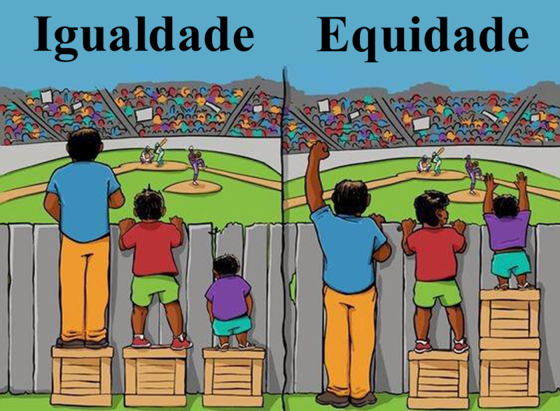

# Glossário

## Sumário:
1. [Lei](#lei)
2. [Regulamentação](#regulamentação)
3. [Norma](#norma)
4. [Instrisecamente](#intrinsecamente)
5. [Lei Carolina Dieckmann](#lei-carolina-dieckmann-lei-nº-127372012)
6. [Marco Civil da Internet](#marco-civil-da-internet-lei-nº-1296514)
7. [Lei Geral da Proteção de Dados(LGPD)](#lei-geral-de-proteção-de-dados-lei-nº-1370918)
8. [Compliance](#compliance)
9. [Direito a Privácidade](#direito-à-privacidade-art-5º-inciso-x)
10. [Direito a Honra](#direito-à-honra-art-5º-inciso-x)
11. [Direito a Imagem](#direito-à-imagem-art-5º-inciso-v--x)
12. [Direito ao Anonimato](#direito-ao-anonimato-art-5º-inciso-iv)
13. [Direito à Informação](#direito-à-informação-art-5º-inciso-xiv--lei-de-acesso-à-informação-lei-nº-125272011)
14. [Direito ao Sigilo](#direito-ao-sigilo-art-5º-incisos-x--xii)
15. [Direito à Igualdade](#direito-à-igualdade-art-5º)
16. [Direito à Segurança](#direito-à-segurança-art-5º)
17. [Diferença entre Calúnia e Difamação](#diferença-entre-calúnia-e-difamação-art-5º-inciso-v--art-138-cod-penal--art-139-cod-penal)
18. [Lei Anticorrupção (Lei 12.846/13)](#lei-anticorrupção-lei-nº-128462013)
19. [Duo Diligence](#due-diligence)
20. [Conflito](#conflito)

### Lei
    É uma regra ou prescrição escrita, estabelecida por uma autoridade soberana, que tem força obrigatória e é destinada a 
    regular o comportamento dos indivíduos e das instituições em uma sociedade sob pena de sanções. As leis são criadas 
    através de um processo legislativo formal e são aplicadas pelo sistema judicial. 

### Regulamentação
    É o conjunto de regras, leis, normas ou diretrizes estabelecidas por uma autoridade competente para governar ou orientar 
    um determinado assunto, setor, instituição ou atividade. Essas medidas são implementadas para garantir que práticas 
    específicas sejam seguidas, promovendo a segurança, a ordem e o cumprimento de padrões legais e éticos.

### Norma
    O termo "norma" refere-se a um princípio, regra ou diretriz que regula o comportamento, procedimentos ou ações dentro
    de um determinado contexto. As normas podem ser legais, morais, sociais ou técnicas e servem como padrões de conduta 
    que orientam como as pessoas devem agir ou como algo deve ser feito. Elas são criadas para garantir ordem, 
    previsibilidade e uniformidade em diferentes aspectos da vida social, profissional e legal.

### Intrinsecamente
    Refere-se a algo que está relacionado ou faz parte essencial da natureza ou característica fundamental de algo.

### Lei Carolina Dieckmann ([Lei nº 12.737/2012](https://www.planalto.gov.br/ccivil_03/_ato2011-2014/2012/lei/l12737.htm))
    Sancionada em 2012 no Brasil. Essa lei foi criada para tratar de crimes cibernéticos, como a invasão de 
    ispositivos eletrônicos, interrupção de serviços digitais ou de conexão, e a falsificação de documentos 
    eletrônicos ou de cartões de crédito e débito. 

### Marco Civil da Internet ([Lei nº 12.965/14](https://www.planalto.gov.br/ccivil_03/_ato2011-2014/2014/lei/l12965.htm))
    Sancionada em 2014 no Brasil.Estabelece princípios, garantias, direitos e deveres para o uso da internet
    no Brasil, além de estipular diretrizes para a ação do Estado dentro das redes.
    
### Lei Geral de Proteção de Dados ([Lei nº 13.709/18](https://www.planalto.gov.br/ccivil_03/_ato2015-2018/2018/lei/L13709.htm))
    Sancionada em 2018 no Brasil. A LGPD regula o tratamento de dados pessoais, tanto no meio digital quanto
    no físico, com o objetivo de proteger a privacidade e os direitos fundamentais dos cidadãos brasileiros em 
    relação ao uso de suas informações pessoais.

### [Compliance](https://fia.com.br/blog/compliance/)
    No âmbito institucional e empresarial, compliance é o conjunto de disciplinas a fim de cumprir e se fazer cumprir as normas legais e regulamentares, as políticas e
    as diretrizes estabelecidas para o negócio e para as atividades da instituição ou empresa, bem como evitar, detectar e tratar quaisquer desvios ou inconformidades
    que possam ocorrer.

    O termo compliance tem origem no verbo em inglês to comply, que significa "cumprir".

### Direito à Privacidade ([Art 5º, inciso X](https://constituicao.stf.jus.br/dispositivo/cf-88-parte-1-titulo-2-capitulo-1-artigo-5))
    O direito à privacidade é um direito fundamental que protege a vida pessoal, profissional e social de um indivíduo, garantindo que informações sobre sua intimidade,
    vida privada, honra e imagem sejam protegidas de divulgação não autorizada. 
    Na Constituição Federal, esse direito está previsto no artigo 5º, inciso X, que declara invioláveis esses aspectos da vida das pessoas, assegurando indenização por
    dano material ou moral decorrente de sua violação.

### Direito à Honra ([Art 5º, inciso X](https://constituicao.stf.jus.br/dispositivo/cf-88-parte-1-titulo-2-capitulo-1-artigo-5))
    Protege a reputação e dignidade de uma pessoa, evitando que ela seja difamada, caluniada ou injuriada. 
    A honra pode ser objetiva (como a sociedade vê a pessoa) ou subjetiva (como a pessoa se vê).

### Direito à Imagem ([Art 5º, inciso V & X](https://constituicao.stf.jus.br/dispositivo/cf-88-parte-1-titulo-2-capitulo-1-artigo-5))
    Garante a proteção contra o uso indevido ou não autorizado da imagem de uma pessoa, sendo um direito personalíssimo. 
    A Constituição Federal assegura a inviolabilidade da imagem no artigo 5º, incisos V e X.

### Direito ao Anonimato ([Art 5º, inciso IV](https://constituicao.stf.jus.br/dispositivo/cf-88-parte-1-titulo-2-capitulo-1-artigo-5))
    O direito ao anonimato envolve a prerrogativa de manter a identidade oculta em certas situações, especialmente para proteger o indivíduo de retaliações ou
    discriminações. 
    No entanto, a Constituição Federal, no artigo 5º, inciso IV, garante a liberdade de expressão, mas veda o anonimato para assegurar a responsabilidade pelas
    manifestações.

### Direito à Informação ([Art 5º, inciso XIV](https://constituicao.stf.jus.br/dispositivo/cf-88-parte-1-titulo-2-capitulo-1-artigo-5)) & ([Lei de Acesso à Informação (Lei nº 12.527/2011)](https://www.planalto.gov.br/ccivil_03/_ato2011-2014/2011/lei/l12527.htm))
    Este direito assegura o acesso a informações de interesse público, fundamentais para a transparência e participação cidadã. Na Constituição Federal, está previsto
    no artigo 5º, inciso XIV. 
    A Lei de Acesso à Informação (Lei nº 12.527/2011) regulamenta esse direito, promovendo a transparência e permitindo que qualquer pessoa solicite informações de
    órgãos públicos.

### Direito ao Sigilo ([Art 5º, incisos X & XII](https://constituicao.stf.jus.br/dispositivo/cf-88-parte-1-titulo-2-capitulo-1-artigo-5))
    O direito ao sigilo protege informações confidenciais, garantindo privacidade e segurança. Existem várias formas de sigilo, como o sigilo bancário, fiscal, médico,
    profissional, e de comunicações. 
    A Constituição Federal protege esse direito no artigo 5º, incisos X e XII, e sua violação pode resultar em sanções legais.

### Direito à Igualdade ([Art 5º](https://constituicao.stf.jus.br/dispositivo/cf-88-parte-1-titulo-2-capitulo-1-artigo-5))
    O direito à igualdade assegura que todos devem ser tratados de forma igual perante a lei, sem discriminação de qualquer natureza. 
    Consagrado no artigo 5º da Constituição Federal, esse direito promove a justiça social e pode exigir ações afirmativas para corrigir desigualdades históricas e garantir oportunidades iguais para todos.
Menções há:  
    ([Principio constituicional da igualdade](https://www.jusbrasil.com.br/noticias/principio-constitucional-da-igualdade/2803750)).  
    

### Direito à Segurança ([Art 5º](https://constituicao.stf.jus.br/dispositivo/cf-88-parte-1-titulo-2-capitulo-1-artigo-5))
    O direito à segurança é essencial para proteger a integridade física, psicológica e patrimonial dos indivíduos. Está garantido na Constituição Federal, no artigo
    5º, que assegura a inviolabilidade da vida, liberdade, igualdade, segurança e propriedade. A segurança pública é dever do Estado, enquanto a segurança pessoal e
    jurídica protegem os direitos individuais.

### Diferença entre Calúnia e Difamação ([Art 5º, inciso V](https://www.planalto.gov.br/ccivil_03/constituicao/constituicao.htm) & [Art 138 Cod. Penal](https://corpus927.enfam.jus.br/legislacao/cp-40#art-138) & [Art 139 Cod. Penal](https://corpus927.enfam.jus.br/legislacao/cp-40#art-139))
    * Calúnia: Consiste em acusar falsamente alguém de ter cometido um crime, sabendo que a acusação é falsa. É um crime contra a honra previsto no artigo 138 do Código
    Penal.

    * Difamação: Consiste em atribuir a alguém um fato ofensivo à sua reputação, que não constitui crime. A difamação está prevista no artigo 139 do Código Penal. 

    Ambos são crimes contra a honra, mas a calúnia envolve a falsa imputação de um crime, enquanto a difamação envolve a atribuição de um fato desonroso que não é
    necessariamente criminoso.

### Lei Anticorrupção ([Lei nº 12.846/2013](https://www.planalto.gov.br/ccivil_03/_ato2011-2014/2013/lei/l12846.htm))
Sancionada em 2013 no Brasil, essa lei estabelece medidas para combater a corrupção e responsabiliza empresas por atos lesivos à administração pública. Ela prevê a
responsabilização objetiva das pessoas jurídicas, impondo sanções que podem incluir multas de até 20% do faturamento. A lei também incentiva a implementação de
programas de compliance e estabelece mecanismos para denúncias e acordos de leniência.

### [Due Diligence](https://fia.com.br/blog/due-diligence/)
Due diligence é um termo utilizado principalmente em contextos empresariais e financeiros, referindo-se ao processo de investigação e avaliação de uma empresa ou ativo antes de uma transação,
como fusões e aquisições, investimentos ou financiamentos. O objetivo do due diligence é garantir que todas as informações relevantes sejam analisadas e compreendidas, minimizando riscos e 
surpresas para as partes envolvidas.

### [Conflito](https://pt.wikipedia.org/wiki/Conflito)
Conflito é uma divergência de interesses, opiniões ou objetivos entre duas ou mais partes, que pode gerar confronto ou disputa. Pode ocorrer em diversas esferas, como pessoal, social, jurídico ou
digital, e envolve a necessidade de resolução para evitar ou encerrar o embate.

### [Confronto](Uteis/Imgs/Confronto.png)
Confronto é uma situação de enfrentamento direto entre duas ou mais partes, caracterizada por uma disputa aberta ou conflito intenso. Pode envolver forças, ideias, ou interesses opostos, resultando em tensão, embate verbal, físico, ou simbólico. Diferente de um simples desacordo, o confronto geralmente implica uma interação ativa e, muitas vezes, hostil, onde as partes buscam impor suas posições ou resolver a disputa de forma decisiva.